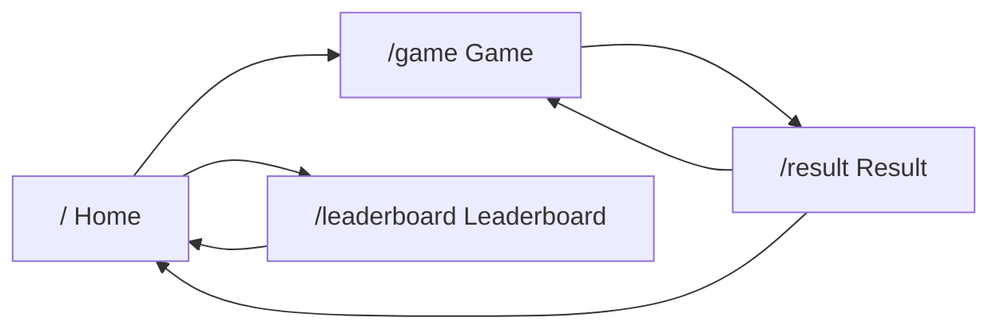
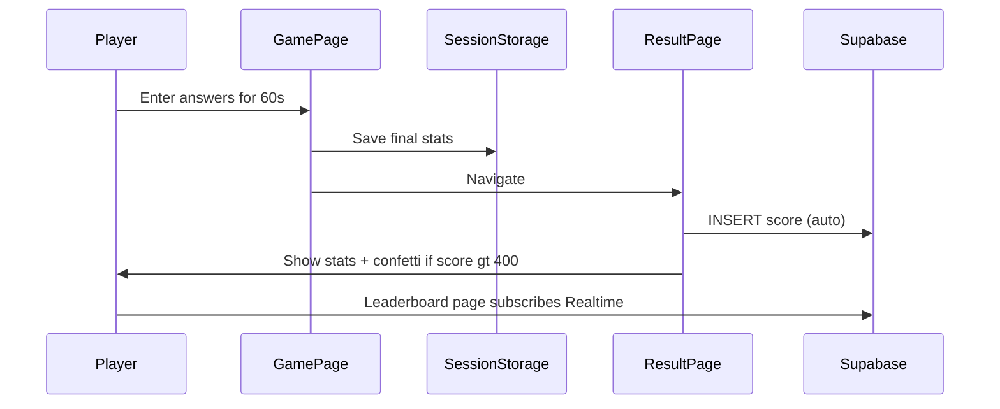

# Math Sprint — Understanding & Build Plan

## What I Understood

**Math Sprint** is a single-player, keyboard-driven mental math game. The player enters their name on the home screen, then has **60 seconds** to answer as many randomly generated questions as possible. Each correct answer is **+10 points**; wrong answers score **0** (no penalties). When time runs out, the game navigates to a **full-page result screen**, **automatically saves** the score to Supabase, and shows stats (score, correct/wrong counts, accuracy). A **leaderboard** shows the top 20 scores with realtime updates.

### Tech Stack (from [req.md](c:\Users\Princekmt01\OneDrive\Desktop\Canteen\req.md))
- **Next.js** (App Router) + **TypeScript**
- **Tailwind CSS** + **shadcn/ui** components
- **Supabase** (only data store — no local DB)
- **Framer Motion** for animations
- **Lucide Icons**

### Game Logic
| Difficulty | Operations | Default ranges (your choice) |
|---|---|---|
| Easy | Addition, Subtraction | Operands 1–20 |
| Medium | Multiplication | Factors 2–12 |
| Hard | Division | Integer-only (generate `divisor × quotient`, show as `dividend ÷ divisor`) |

Questions are **randomly mixed** across all four operation types. One question at a time, **no skipping**, **Enter to submit**, input **auto-focused**, timer **keeps running** while answering, game ends **exactly at 60s**.

### Screens & Routes


- **Home (`/`)**: Title, description, player name input, Play + Leaderboard buttons
- **Game (`/game`)**: Question, answer input, live score, 60s timer, progress bar; green/red flash + sounds on answer; countdown emphasis in last 10s
- **Result (`/result`)**: Final score (animated counter), correct/wrong/accuracy, confetti if score > 400, Play Again; score **auto-submitted** to Supabase on arrival
- **Leaderboard (`/leaderboard`)**: Top 20 by score — player name, score, accuracy, date; **Supabase Realtime** subscription for live updates

### Database — `scores` table
| Column | Type |
|---|---|
| `id` | uuid (PK, default) |
| `player_name` | text |
| `score` | integer |
| `correct_answers` | integer |
| `wrong_answers` | integer |
| `accuracy` | numeric |
| `created_at` | timestamptz (default now) |

Deliverables include **SQL schema file** + README with **full Supabase project setup** (create project, run SQL, enable Realtime, copy env vars). Note: Supabase tables cannot be created safely from the browser with the anon key alone — setup will use a documented SQL migration the user runs once in the Supabase SQL editor (with optional health-check on app start that verifies the table exists and shows a clear error if not).

### UI / Polish
- Responsive, modern, glassmorphism cards, gradient background, large typography
- **Dark / light mode** via `ThemeToggle` (next-themes + shadcn)
- **Framer Motion**: page transitions, score counter, timer urgency (last 10s), progress animation
- **Confetti** when final score > 400
- **Small sound effects** via Web Audio API (no external asset dependency)
- Components: `Navbar`, `GameCard`, `QuestionCard`, `Timer`, `ScoreBoard`, `LeaderboardTable`, `ResultModal` (reused as result summary card on `/result` page), `ThemeToggle`, `LoadingSpinner`

### Your Confirmed Preferences
- Supabase: **include full setup instructions** in README
- Result UX: **full-page** at `/result`
- Score save: **automatic** when game ends
- Question ranges: **sensible defaults** (table above)

---

## Project Structure

```
Canteen/
├── app/
│   ├── layout.tsx          # Root layout, theme provider, navbar
│   ├── page.tsx            # Home
│   ├── game/page.tsx       # Game screen
│   ├── result/page.tsx     # Result screen (reads game state from sessionStorage)
│   └── leaderboard/page.tsx
├── components/             # All UI components from spec
├── lib/
│   └── supabase/           # Client + server helpers
├── hooks/                  # useGame, useTimer, useLeaderboard
├── types/                  # Score, GameState, Question types
├── utils/                  # Question generator, scoring, accuracy calc
├── animations/             # Framer Motion variants
├── public/
├── supabase/schema.sql
├── .env.example
└── README.md
```

**State between game → result**: Pass final game stats via `sessionStorage` (name, score, counts, accuracy) so the result page can auto-submit once and display stats without re-playing the game.

---

## Implementation Steps

### 1. Scaffold Next.js project
- `create-next-app` with TypeScript, Tailwind, App Router, ESLint
- Install: `@supabase/supabase-js`, `framer-motion`, `lucide-react`, `canvas-confetti`, `next-themes`
- Init **shadcn/ui** (Button, Input, Card, Table, etc.)

### 2. Supabase layer
- [`lib/supabase/client.ts`](lib/supabase/client.ts) — browser client
- [`lib/supabase/server.ts`](lib/supabase/server.ts) — server client for any server actions
- [`supabase/schema.sql`](supabase/schema.sql) — table + RLS policies (public read/insert for anonymous leaderboard)
- Enable Realtime on `scores` table in README steps
- [`.env.example`](.env.example): `NEXT_PUBLIC_SUPABASE_URL`, `NEXT_PUBLIC_SUPABASE_ANON_KEY`

### 3. Core game utilities
- [`utils/questions.ts`](utils/questions.ts) — random question generator with integer division guarantee
- [`utils/scoring.ts`](utils/scoring.ts) — +10 correct, accuracy = `correct / (correct + wrong) * 100`
- [`hooks/useTimer.ts`](hooks/useTimer.ts) — 60s countdown, ends game at 0
- [`hooks/useGame.ts`](hooks/useGame.ts) — question flow, answer validation, score tracking, flash states

### 4. Pages & components
- **Home**: validate name (non-empty), store in sessionStorage, navigate to `/game`
- **Game**: timer + question loop; on timeout → write stats to sessionStorage → `/result`
- **Result**: read stats, call `insertScore()`, show animated summary + confetti if > 400, Play Again → `/game`
- **Leaderboard**: fetch top 20 ordered by `score DESC`, subscribe to Realtime `INSERT` events

### 5. UI polish
- Gradient background + glass cards in global styles
- Theme toggle in navbar
- Green/red answer flash overlays
- Web Audio beeps for correct/wrong
- Timer progress bar + pulse animation in last 10 seconds
- Animated score counter on result page

### 6. README & docs
- Prerequisites, Supabase project creation, SQL run, Realtime enable, env setup
- `npm install` → `npm run dev`
- No TODOs or placeholder code

---

## Architecture Diagram



---

## Out of Scope (not in req.md)
- User authentication / anti-cheat
- Difficulty selector (always random mix)
- Mobile touch-optimized custom keyboard (keyboard-first is fine; mobile still works with native keyboard)
